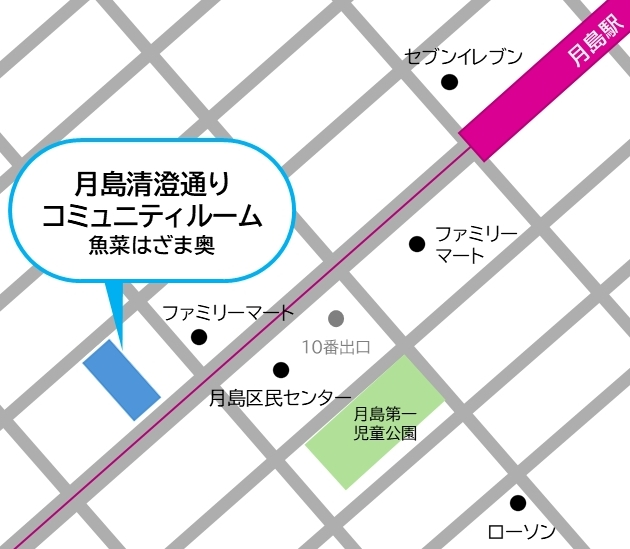

## 開催場所

### 月島清澄通りコミュニティルーム  
東京都中央区月島3-13-5 魚菜はざま奥  
【交通アクセス】  
●大江戸線、有楽町線・月島駅 10番出口 徒歩3分  
●江戸バス・月島区民センター 徒歩4分   
●都営バス・月島3丁目 徒歩2分  

### 勝どきデイルーム
中央区勝どき 1-5-1 勝どき区民館１階  
【交通アクセス】  
●大江戸線・勝どき駅 A1出口 徒歩1分  
●江戸バス [南循環]  
勝どき駅 徒歩3分 or 勝どき駅前 徒歩3分  

### 月島
🚫注意！　現在はこちらでは開催しておりません。  
【場所：東京中央区月島 3-10-4 第三いちかわビル301 302】  

